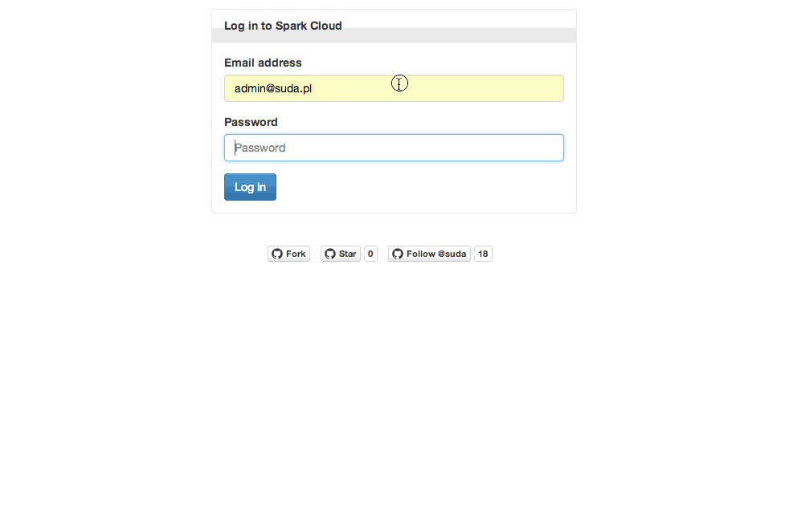

# [Click here to launch Particle Web Interface](http://suda.github.io/particle-web-interface/)

This is a simple client side panel for interaction with [Particle Cloud](https://www.particle.io/) variables and functions.

May be used as alternative to `particle call` and `particle variable` CLI commands.

## Demo

## Disclaimer

Your information is only sent to particle Cloud. I do not receive nor store any credentials or identifiers.

## [Contributions welcome](http://contributionswelcome.org/)

All contributions (no matter if small) are always welcome.

To see how you can help and where to start [see Contributing file](CONTRIBUTING.md).
